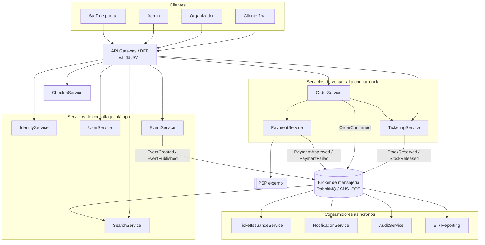
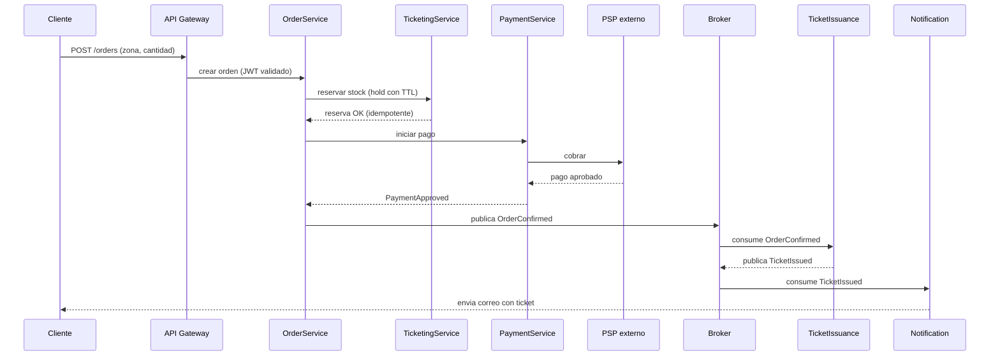
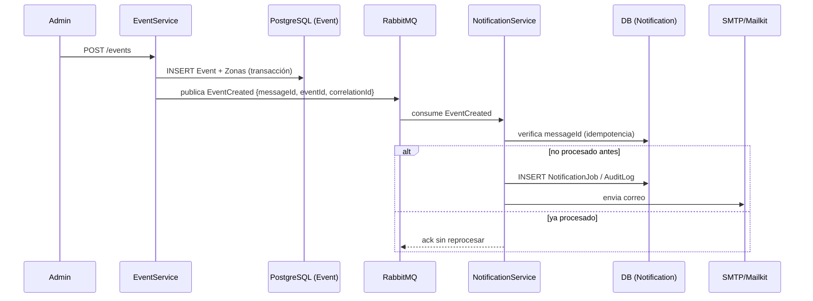

# Arquitectura — Plataforma de Eventos Online

## 1. Resumen y principios de diseño

La plataforma se diseña como un sistema **basado en microservicios y eventos**, donde:

- Cada microservicio es dueño de su propia base de datos (**database-per-service**).
- La comunicación **síncrona (HTTP/REST o gRPC)** se usa solo cuando el caller necesita una respuesta inmediata para continuar (login, búsqueda, iniciar una compra).
- La comunicación **asíncrona (eventos vía broker)** se usa para todo lo que es "notificar que algo pasó" y para desacoplar servicios con distinto ciclo de vida (creación de evento → indexar en buscador → notificar por correo → registrar en BI).
- La consistencia se logra con **Saga pattern** (coreografía basada en eventos) en vez de transacciones distribuidas de 2PC, dado el alto volumen y la necesidad de disponibilidad.
- El diseño prioriza que una falla parcial (ej. cae el proveedor de pagos) no tumbe la búsqueda ni la navegación de eventos.

---

## 2. Listado de microservicios

| Servicio | Responsabilidad | Tipo de comunicación principal |
|---|---|---|
| **IdentityService** | Emisión y validación de JWT, integración OIDC/OAuth2, gestión de roles | Síncrono (todos lo consultan vía Gateway) |
| **UserService** | Perfiles de clientes, promotores, admins, staff | Síncrono |
| **EventService** | CRUD de eventos y zonas, reglas de publicación | Síncrono (escritura) + publica eventos |
| **SearchService** | Búsqueda avanzada de eventos publicados, filtros, ranking | Síncrono (lectura) + consume eventos para indexar |
| **TicketingService (Inventory)** | Control de aforo/disponibilidad por zona, holds temporales | Síncrono (reserva) + eventos |
| **OrderService** | Orquesta la saga de compra (reserva → pago → emisión) | Síncrono (inicia) + eventos (orquestación) |
| **PaymentService** | Integración con PSP externo, intents, reembolsos | Síncrono con PSP + eventos internos |
| **TicketIssuanceService** | Generación de QR/Barcode, almacenamiento del ticket | Consumidor de eventos |
| **CheckInService** | Validación de ingreso, soporta modo offline con sync posterior | Síncrono (online) + batch sync (offline) |
| **NotificationService** | Envío de email/SMS/push/WhatsApp | Consumidor de eventos |
| **AuditService** | Trazabilidad de operaciones críticas (compliance) | Consumidor de eventos (todos publican) |
| **AntifraudService** (externo/integrado) | Scoring de riesgo en compras | Síncrono desde OrderService |
| **BI/Reporting** | Data warehouse alimentado por streaming de eventos | Consumidor de eventos (CDC/stream) |

> Para el MVP del reto solo se implementan `EventService` y `NotificationService`; el resto queda documentado como visión completa del sistema.

---

## 3. Diagrama de componentes

**Notas del diagrama:**
- Las flechas sólidas hacia `GW` representan tráfico **síncrono HTTP**.
- Las flechas hacia el broker (`MB`) representan **publicación de eventos**; las flechas desde `MB` representan **consumo asíncrono**.
- `CheckInService` opera mayormente offline en el dispositivo del staff, sincronizando lotes de validaciones cuando recupera conectividad.

---

## 4. Flujo síncrono + asíncrono: compra de ticket (Saga)

Si el pago falla o expira el TTL del hold, `TicketingService` libera el stock (`StockReleased`) y `OrderService` marca la orden como fallida — esto es la **compensación de la saga**, evitando sobreventa sin bloquear con transacciones distribuidas.

---

## 5. Flujo del MVP: `EventCreated`

Reintentos: si `NotificationService` falla al procesar, MassTransit reintenta con backoff (ej. 3 intentos); si sigue fallando, el mensaje se mueve a una cola `_error` (DLQ) y el estado se marca `Failed` en la tabla de notificaciones para revisión manual.

---

## 6. Justificación de motores de base de datos

| Servicio | Motor | Por qué |
|---|---|---|
| EventService | **PostgreSQL** | Datos relacionales (evento–zonas), integridad referencial, transacciones ACID para creación conjunta |
| TicketingService / OrderService | **PostgreSQL** + **Redis** | ACID para inventario; Redis para holds con TTL y locks distribuidos en picos de concurrencia |
| SearchService | **OpenSearch / Elasticsearch** | Búsqueda full-text, filtros facetados, ranking — mal soportado por SQL puro |
| NotificationService | **MongoDB / DynamoDB** | Esquema variable por canal (email/SMS/push/WhatsApp), alto volumen de escritura append-only |
| CheckInService | **DynamoDB** (+ SQLite local en el dispositivo) | Lecturas de baja latencia, soporta el patrón offline-first del staff de puerta |
| AuditService | **DynamoDB / OpenSearch** | Almacenamiento append-only, consultas por rango de tiempo y correlationId |
| BI/Reporting | **Redshift / Data warehouse** | Consultas analíticas agregadas, alimentado por streaming de eventos (Kinesis/CDC) |

---

## 7. Autenticación, autorización y seguridad

- **OIDC/OAuth2** como estándar: un Identity Provider (Cognito, Keycloak o IdentityService propio) emite JWT firmados.
- El **API Gateway** valida el JWT en el borde (firma, expiración, audiencia) antes de enrutar — los microservicios internos confían en el gateway pero igual validan claims de rol.
- **Roles**: `Admin` (POST /events, gestión), `Organizador` (gestión de sus propios eventos), `Cliente` (compra, GET), `Staff` (check-in).
- **Anti-IDOR**: cada consulta a recursos "propios" (mis órdenes, mi perfil) filtra por `userId` extraído del JWT, nunca por parámetro de la URL sin validar pertenencia.
- **Manejo de errores**: respuestas de error estandarizadas (`ProblemDetails`), nunca se expone stack trace ni mensajes de motor de BD al cliente.
- **Rate limiting**: throttling por IP/usuario en el Gateway (ej. AWS API Gateway usage plans, o middleware con Redis de por medio).
- **Logs**: correlationId en cada log, sin tokens/passwords/PII; PII enmascarada en logs de aplicación.
- **Comunicación interna**: mTLS o JWT de servicio entre microservicios dentro de la VPC.

---

## 8. Arquitectura en AWS (nube o híbrida)

- **Edge**: CloudFront + WAF → API Gateway (autenticación OIDC vía Cognito).
- **Cómputo**: ECS Fargate para los servicios "always-on" (Event, Ticketing, Order, Payment); Lambda para consumidores ligeros orientados a eventos (Notification, TicketIssuance) — escalan a cero y siguen el patrón "pay per use".
- **Mensajería**: EventBridge o SNS como bus de eventos, con una cola SQS por consumidor (incluye DLQ automática) — esto reemplaza RabbitMQ en el despliegue cloud manteniendo el mismo contrato de mensajes.
- **Datos**: RDS PostgreSQL (Multi-AZ) para servicios transaccionales, DynamoDB para notificaciones/check-in/auditoría, OpenSearch Service para búsqueda, ElastiCache Redis para cache y locks.
- **Almacenamiento**: S3 para los QR/tickets generados y backups.
- **Observabilidad**: CloudWatch + X-Ray para tracing distribuido entre servicios.
- **Escenario híbrido**: si parte de la infraestructura permanece on-premise (ej. DB heredada de un ERP de facturación), se integra vía VPN/Direct Connect y un adaptador anti-corrupción (ACL) en `PaymentService` o `BI`, sin exponer directamente esos sistemas legacy al resto de microservicios.

---

## 9. Patrones de resiliencia y alta concurrencia

- **Idempotencia**: cada mensaje lleva `messageId`; los consumidores lo persisten antes de procesar para evitar duplicados.
- **Retry + backoff exponencial** (Polly / MassTransit) en llamadas a servicios externos (PSP, SMTP).
- **Circuit breaker** (Polly) alrededor de la integración con el PSP — si falla repetidamente, se abre el circuito y se informa error controlado en vez de colgar la request.
- **Bulkhead**: pools de conexión y colas separadas por tipo de operación, para que un pico en notificaciones no afecte al flujo de compra.
- **Saga con compensación** para el flujo de compra (ver diagrama sección 4), evitando 2PC.
- **Picos de venta (flash sales)**: patrón de "sala de espera virtual" — las solicitudes de compra entran a una cola SQS/RabbitMQ y un worker con concurrencia controlada las va procesando en orden, evitando que 50,000 requests simultáneas golpeen la base de datos de inventario a la vez.
- **Cache-aside con Redis** para `GET /events`, invalidado al recibir `EventUpdated`.
- **Autoscaling** basado en profundidad de cola (para consumidores) y en CPU/latencia (para servicios síncronos).

---

## 10. Alcance del MVP vs. visión completa

Este documento describe la **arquitectura objetivo completa**. El MVP técnico del reto (2 días) implementa un subconjunto deliberadamente acotado:

- `EventService` (API 1) y `NotificationService` (API 2), comunicados vía broker de mensajería.
- Persistencia en PostgreSQL (o SQL Server) por servicio.
- Frontend React mínimo para registrar eventos.
- Idempotencia, reintentos y manejo de fallos en el consumidor, como se detalla en la sección 5.

El resto de los microservicios (Ticketing, Order, Payment, Search, CheckIn, etc.) se documentan aquí para demostrar la visión arquitectónica completa, pero no forman parte del código entregado en el MVP.
